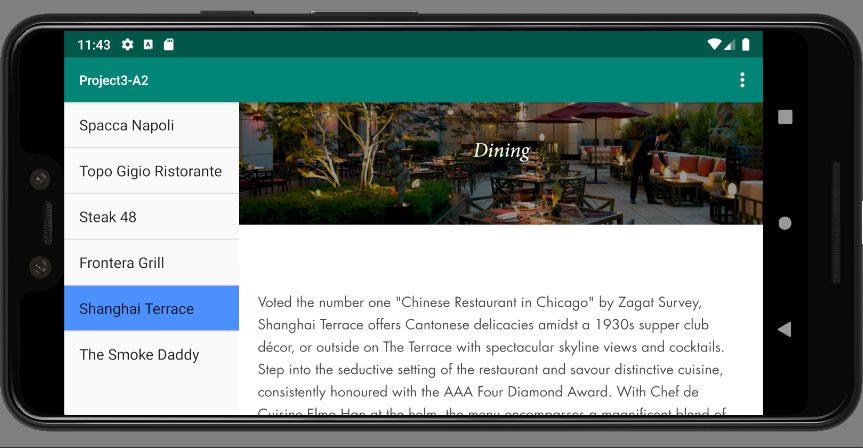

# Project 3 for CS478: Software Development for Mobile Platforms
## By: Allen Breyer

## Description
A project that involved designing and coding two Android apps meant to work together on an Android phone or tablet running version
9, Pie. The first app, A1, helps visitors in Chicago decide on points of interest in the nation’s capital. The
second app, A2, has specific information about the points of interest.

One application defines a specific dangerous level permission while the second application receives the intents only if the sender owns that specific permission. The second application also involves using multiple fragments, an options menu, a custom action bar,  and is compatible with both landscape and portrait modes, including retaining application states across device reconfigurations.

